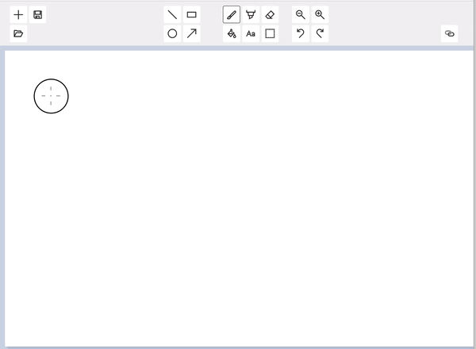

# Translation App

Translation App is a web app built within the MetaOS platform. It allows users to translate from a soruce language to a target language. The backend is hooked up to Azure Portal Translation Service. 

## Development

### Clone repository

    `git clone https://github.com/OfficeDev/m365-extensibility-image-editor.git`
    Run all commands from the root of m365-extensibility-image-editor

### Prerequisites

    Node.js
    <https://nodejs.org/en/>

    Yarn
    <https://yarnpkg.com/getting-started/install>

### Install

    run `yarn refresh-vs-token`
    run `yarn install`

### Build and run

To run devserver on localhost using https,

    `yarn start`

Dev server will run on <https://localhost:8080>

### Running Cross Microsoft Meta OS Hubs (Office.com, Outlook, and Teams)

Within Microsoft Teams, a user can upload a 'manifest file' (config file) that is then read by the Microsoft Meta OS Hubs, to host the Editor app within the iframe of the hubs -giving the user access to the app within all three hubs.

To do this

    1. run `yarn start`
    2. edit manifest file `**configs\metaOs-hubs\manifest.json**`

    3. zip all files in the **configs\metaOs-hubs** folder
    4. go to https://dev.teams.microsoft.com/apps and click **Import App** to upload the .zip file.
    5. go to the new app's entry, click **preview app**, and after teams has loaded, click add.

Now it should be available on all hubs.  
**Access app on Teams**  

**Access app on Office**  
https://www.office.com/m365apps  

**Access app on Outlook**  

### Build production

Building minified production files  
`yarn build:prod`  
minified files placed in dist folder

To test build packages  
`yarn start:prod` to test prod using webpack dev server

### Unit Tests

To run jest unit tests  
`yarn test`

### Linting

To run linting  
`yarn lint`  
To run linting and automatically fix issues  
`yarn lint:fix`

## Troubleshooting

For auth (401s) install issues check your .npmrc in your local users folder. Backup and delete
your npmrc file and try to refresh your npmrc token and install again.

## Contributing

This project welcomes contributions and suggestions. Most contributions require you to agree to a
Contributor License Agreement (CLA) declaring that you have the right to, and actually do, grant us
the rights to use your contribution. For details, visit <https://cla.opensource.microsoft.com>.

When you submit a pull request, a CLA bot will automatically determine whether you need to provide
a CLA and decorate the PR appropriately (e.g., status check, comment). Simply follow the instructions
provided by the bot. You will only need to do this once across all repos using our CLA.

This project has adopted the [Microsoft Open Source Code of Conduct](https://opensource.microsoft.com/codeofconduct/).
For more information see the [Code of Conduct FAQ](https://opensource.microsoft.com/codeofconduct/faq/) or
contact [opencode@microsoft.com](mailto:opencode@microsoft.com) with any additional questions or comments.

## Trademarks

This project may contain trademarks or logos for projects, products, or services. Authorized use of Microsoft
trademarks or logos is subject to and must follow
[Microsoft's Trademark & Brand Guidelines](https://www.microsoft.com/en-us/legal/intellectualproperty/trademarks/usage/general).
Use of Microsoft trademarks or logos in modified versions of this project must not cause confusion or imply Microsoft sponsorship.
Any use of third-party trademarks or logos are subject to those third-party's policies.
